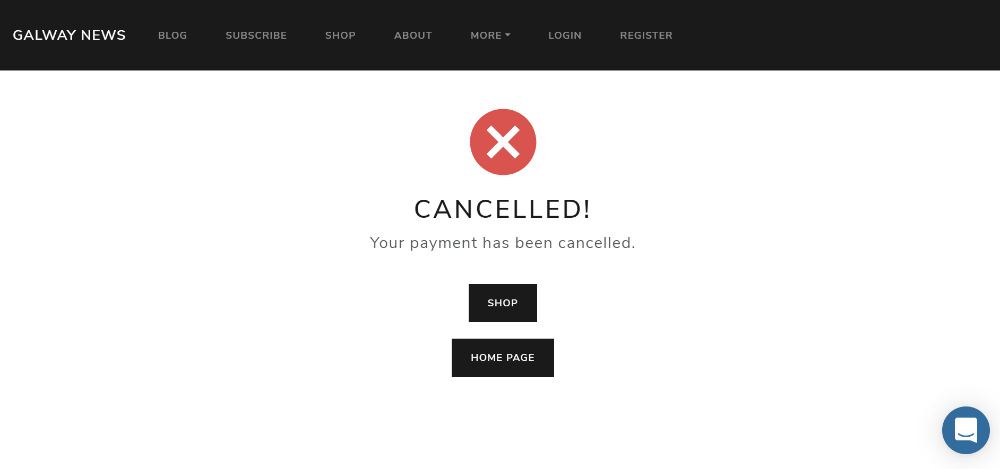
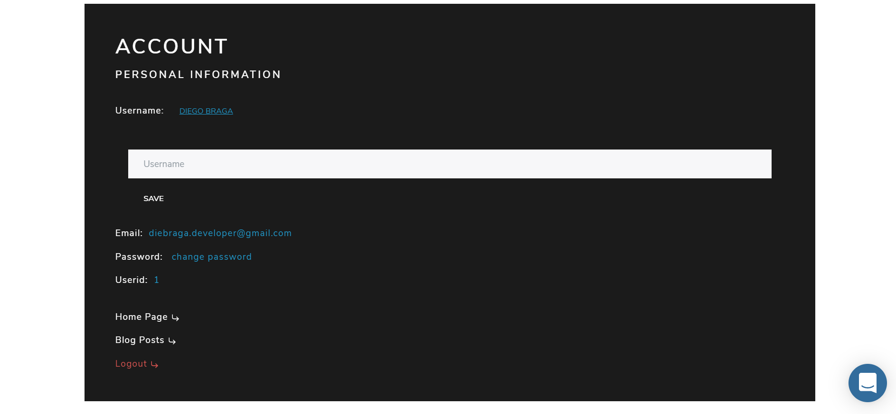
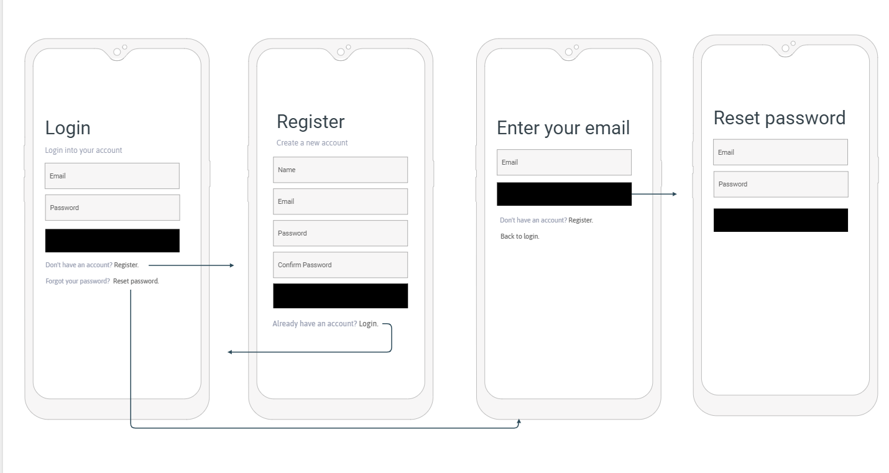

# news galway
Responsive Blog app using django rest framework, Reactjs with ecommerce funcionalities using Stripe.

## Live Demo
The app is deployed running on Heroku: <br/> https://galway-news-app.herokuapp.com/

## About
The app is directed to people from or interested in whats in currently going on in galway city or just interested in follow <br/>
The staff in what they post. <br/>
The Blog features the last news from Galway city divided in four categories "News" "Gastronomy" "Events" <br/>
and "jobs" it has a Donation subscription page and a eccomerce page with a few products that you can buy from. <br/>
You can also meet our staff, view profile and get in touch sending a e-mail with make sugestions or queries. <br/>
The app is also provided of a realtime chat that you can get in touch easily with the staff and a comment section <br />
where authenticated users can interact with posters and view what other users think.
to read more about the articles, filter, view profile, access shop or subscribe you'll be requested to authenticate. <br/>

## Technologies
- <a href='https://www.django-rest-framework.org/' target='_blank'>django-rest-framework</a><br/>
- <a href='https://djoser.readthedocs.io/en/latest/getting_started.html' target='_blank'>Djoser</a><br/>
- <a href='https://jwt.io/introduction/' target='_blank'>JWT Authentication</a><br/>
- <a href='https://www.heroku.com/postgres' target='_blank'>Heroku PostgresSQL</a><br/>
- <a href='https://docs.djangoproject.com/en/3.1/ref/contrib/admin/' target='_blank'>Django admin panel</a><br/>
- <a href='https://github.com/summernote/django-summernote' target='_blank'>Django Summernote</a><br/>
- <a href='https://reactjs.org/' target='_blank'>ReactJs</a><br/>
- <a href='https://react-redux.js.org/' target='_blank'>React Redux</a><br/>
- <a href='https://reactjs.org/docs/hooks-intro.html' target='_blank'>React Hooks</a><br/>
- <a href='https://reactrouter.com/web/guides/quick-start' target='_blank'>React router dom</a><br/>
- <a href='https://getbootstrap.com/' target='_blank'>Bootstrap</a><br/>
- <a href='https://stripe.com/docs/stripe-js/react' target='_blank'>React Stripe</a><br/>
- <a href='https://github.com/dennismorello/react-awesome-reveal' target='_blank'>react-awesome-reveal</a><br/>
- <a href='https://www.intercom.com/dr/sponsor-biz?utm_source=google&utm_medium=sem&utm_campaign=8375307833&utm_term=intercom&utm_ad_collection=88632091427&_bt=434730769386&_bg=88632091427&utm_ad=434730769386&offer=sponsoredbybiz&utm_campaign_name=go_evg_acq_trial_b-a_icm_bld_core_en&utm_ad_collection_name=gen-p_intercom&utm_ad_name=sponsoredbybiz_text_21q2' target='_blank'>Intercom real-time chat bot</a><br/>
- <a href='https://stripe.com/ie?utm_campaign=paid_brand-IE_en_Search_Brand_Stripe-1615558792&utm_medium=cpc&utm_source=google&ad_content=307359047676&utm_term=stripe&utm_matchtype=e&utm_adposition=&utm_device=c' target='_blank'>Stripe</a><br/>

## User Experience (UX)

-   ### User stories

    -   #### Staff User

        1. As a Staff user, I want to have a nice experience and easily write and edit my blog posts.
        2. As a Staff user, I want to be able to easily manage the products and the website content.
        3. As a Staff user, I want to know what non staff users think about my job with comments.
        3. As a Staff user, I want non staff users have the option to know more about me and get in touch.

    -   #### Non Staff User

        1. As a non staff user, I want to Know where I need to go when I first get into the website.
        2. As a non staff user, I want to find the best way to get in touch, with the staff.
        3. As a non staff user, I want to view the relevant news with a nice and beaultiful UI.
        3. As a non staff user, I want to feel integrated to the app with comments and suggestions.


-   ### Design
    -   #### Colour Scheme
        -   Galway news use 2 main colors: Black and white.
    -   #### Typography
        -   Roboto it's the main font imported from google fonts.


## Features and Fuctionalities

### Backend 

- App built in Django Rest Framework divided in 8 apps: accounts, authors, blogs, products, subscriptions cantacts and suggestioins.
- accounts: 
    Stores all users in the application, the custom user model. using Djoser as library <br/>
    the app uses Djoser's default permissions. Any CRUD operation in the user it's allowed the  <br />
    Current user or Admin, in this case if user try to list or any action to users it's gonna have <br />
    effect to his own user only. you can also: create account 'allow any', activate account email: 'allow any',  <br />
    create session or token: 'allow any', destroy token: 'Autenticated', reset and comfirm reset password email: 'allow any', <br/>
    reset and comfirm reset user name email: 'allow any'. Admin users can perform any crud action in the Admin panel to users <br />
    In the Admin panel admin users can create, update and delete accounts.
- authors: Stores our staff profile as a separated entity from accounts that represents our staff. Any user can list all authors. <br/> 
    However you want to get an specific author by id you need to be Authenticated. the app has a one to many to blogs app where <br/>
    resides all post in the app, The author can have many posts. <br/>
    In the Admin panel admin users can create, update and delete accounts.
- blogs: Stores all posts in application. Any user can list all posts but in order to view a single post by slug, users need  <br/>
    to be authenticated the app is related to authors app. a post can have an Author, only admin users can poerform delete requests. <br/>
    the app also handler send email fuctionalities when users create when request new passords. <br/>
    post are created in the Admin panel by admin users only, other than update and delete.
- comments: Stores all comments in the application, if authenticated users can create and list comments but in order to update or <br/>
    delete the user has to be the comment owner by custom permission, the app is related to blogs app, a blog post can have,
    many comments. <br/>
    In the Admin panel admin users can create, update and delete comments.
- products: Stores all Stripe products in the databese 'including id keys': Authenticated users can only read products and buy products  <br />
    the rest in handled by stripe, you can view all logs in the app through stripe dashboard create new products,  <br />
    custom email template, discount cupons and way more features improving security.  <br />
    The products can be managed through the admin panel by admin users, create, delete amnd update.
- subscriptions: Stores all Stripe subscription products in the databese 'including id keys': Authenticated users can only read products   <br />
    and buy products the rest in handled by stripe, you can view all logs in the app through stripe dashboard create new products,  <br />
    custom email template, discount cupons and way more features improving security.  <br />
    The subscriptions products can be managed through the admin panel by admin users, create, delete amnd update.
- contacts: Handle send email funcionalitie and Stores in the database. Any user can perform a post request to get in touch. <br/>
    those sent emails can be manage by admin users in the admin panel.
- suggestions: Stores suggestions made by users, any authenticated user can send a request or list them however only the suggestion owner <br/>
    can update or delete by custom permission. <br/> 
    also suggestions can be manage by admin users in the admin panel.
    
#### Extra:

- Django administration panel:
    Django admin panel plays a important role in this application, as staff users are going to make posts and manage the other resoures <br/>
    through it. because of that the admin interface has been customised in other to match the website's theme colors, and improve <br/>
    users experience.
    <details>
    <summary>Click to views admin login</summary>
    

    </details>
    <details>
    <summary>Click to views admin dashboard</summary>
    

    </details>
    <details>
    <summary>Click to views admin logout</summary>
    

    </details>
- <a href='https://github.com/summernote/django-summernote' target='_blank'>Django Summernote:</a><br/>
    As the application is essentially blog, and staff users can writte the posts through the admin panel django summernote is markdown <br />
    editor that makes so easy to implement images, videos, links, colors etc... it makes a huge diferrence for staff users writing they <br/>
    posts. However precations have to be taken while writing or editing the posts. as in the frontend is set innerHTML to render the <br/>
    a bad adition can break the layout, but it can be fixed editing again the post.
    </details>
    <details>
    <summary>Click to views Django Summernote editor</summary>
        

    </details>

 - SMTP configuration: 
    I'm using a smtp service ofered by gmail to handle send emails, to create account, request new password, oer contact us <br/>
    create your credentials to fill your .env file following those steps on 
    <a href='https://support.google.com/mail/answer/185833?hl=en-GB'>GOOGLE</a>  or use Mailtrap or whatever service you prefer.

### Frontend
- Create react app  using react-router-dom to manage all routes in the app. <br/>
- Home Page: <br />
    Landing page that gives you a few options of navigation 'Start' 'Shop' 'Subscribe' 'register' 'login,  github's and likendin's links <br />
    <details>
    <summary>Click to views Home Page</summary>
    

    </details>
- Blog Page: <br />
    List all posts and the featured post in the application, users can click in each post to read more about the post howerver users <br />
    need to be authenticated in order to see the post details.
    <details>
    <summary>Click to views Blog Page</summary>
    

    </details>
    Clicking in any post the user will be direct to a page with all about the post, content, author and when it was posted.
    <details>
    <summary>Click to views Blog Single Page</summary>
    

    </details>

- Comments: <br />
    When clicking in one blog users are direct to a read more page. in the botton of the page there's a comments section <br/>
    where users can iteract with the post comments, theyu can alsdo update and delete they own comments.
    <details>
    <summary>Click to views Comments Section </summary>
    

    </details>

- Shop and Subscribe Page: <br />
    Shop page lists all products avalibe in the website. as e-commerce is not the websites focus galway news ha just a few products <br/>
    that users can purchase, The subscription page is very similar but with montly plans instead, users can subscribe in order to support <br/>
    the website donating. After users transactions users can have a visual feedback if payment has been made 'Success' or not 'Fail'.
    <details>
    <summary>Click to views Shop Page</summary>
    

    </details>
    
    <details>
    <summary>Click to views Subscribe Page</summary>
    

    </details>

    <details>
    <summary>Click to views Success Page</summary>
    

    </details>

    <details>
    <summary>Click to views Failed Page</summary>
    

    </details>

- About Page: <br />
    About page is devided in 3 subsections, About us: users can have the opportunity to know more about the company  <br/>
    Get in touch: users can easily get in touch with Galway news sending a Email. <br />
    Authors: Users can have the opportunity to know more about the staff, users can click to know more info <br />
    about the but to do that they need to be authenticated.
    <details>
    <summary>Click to views about us and get in touch sectiion</summary>
    

    </details>

    <details>
    <summary>Click to views authors sectiion</summary>
    

    </details>

- Account Page: <br />
    Page where users can view their own account information or logout, the page allows users to reset their usernames <br/>
    or password.
    <details>
    <summary>Click to views Account Page</summary>
    

    </details>

- Suggestions and Suggest Pages: <br />
    In Suggest page is the space where users can send suggestions or queries, Sugestions Page is the space where  <br/>
    all suggestions are listed. users can also update and delete their own suggestions or know more about it by clicking.
    <details>
    <summary>Click to views Suggest Page</summary>
    

    </details>

    <details>
    <summary>Click to views Suggestions Page</summary>
    

    </details>


### Database Model.

<details>
<summary>Click to views Structure</summary>


</details>


### Mockups

  - Header <br/> 
  
    <details>
    <summary>Click to views Mockups</summary>
       

    </details>    

  - Authentication <br/> 
  
    <details>
    <summary>Click to views Mockups</summary>
       

    </details>        

  - Blog <br/> 

    <details>
    <summary>Click to views Blog Mockups</summary>
    

    </details>
    
    <details>
    <summary>Click to views Comment Mockups</summary>
    

    </details>        

  - Shop & Subscribe <br/> 
 
    <details>
    <summary>Click to views Comment Mockups</summary>
    

    </details>        

  - About <br/> 

    <details>
    <summary>Click to views About Mockups</summary>
    

    </details>            


 ## Test and Validations
  - I'm using <a href="https://insomnia.rest/">Insomnia<a/> to do my api requests and test the api routes, the insominia JSON file is <br/> avalibe in the server root folder. feel free to use <a href="https://www.postman.com/">Postman</a> or any other.
  - Test routes:
    - List Authors <br/> 
    Method `'GET': http://127.0.0.1:8000/api/authors/` <br/>
    <details>
    <summary>Click to view</summary>
    
        
        As you can see it returns all authors in the Database if it's empty it simple returns an [] array.
    </details>

    - List Author by pk <br/> 
    Method `'GET': http://127.0.0.1:8000/api/authors/<pk>` <br/>
    <details>
    <summary>Click to view</summary>
    
    
        As you can see typing the id_ at the ending it returns the specific author. if the author does not exist it simple returns "not found".
    </details>
    
    - List Posts <br/> 
    Method `'GET': http://127.0.0.1:8000/api/blog/` <br/>
    <details>
    <summary>Click to view</summary>
    
    
        As you can see it returns all posts in the Database if it's empty it simple returns an [] array.                
    </details>
    
    - List Post by slug <br/> 
    Method `'GET': http://127.0.0.1:8000/api/blog/<slug>` <br/>
    <details>
    <summary>Click to view</summary>
          
    
        As you can see typing the <slug/> at the ending it returns the specific post with the content. if the 
        author does not exist it  simple returns "not found".    
    </details>
    
    - Find post by category <br/> 
    Method `'POST': http://127.0.0.1:8000/api/blog/category` <br/>
    <details>
    <summary>Click to view</summary>
    

        As you can see simple posting the category it returns an array with all posts in this category is it's empity 
        it returns an array [].
    </details>
    
    - Create new user <br/> 
    Method `'GET': http://127.0.0.1:8000/auth/users/` <br/>
    <details>
    <summary>Click to view</summary>
            
    
    
        As you can see all fields server side validations are handled by Djoser in case of invalid email,
        week password, blank fields and email already exists, in case of success it returns a status 200 with your id
        and email.
    </details>
    
    - Activate new user <br/> 
    Method `'POST': http://127.0.0.1:8000/auth/users/activation/` <br/>
    <details>
    <summary>Click to view</summary>
        
    
    
    When you recieve the email with the token to activate account you can post the uid and token djoser validates 
    if the token is valid or not, if it has been sent returns a status 200.
    clicking it redirects you to the frontent.

    </details>
    
    - Create Session <br/> 
    Method `'POST': http://127.0.0.1:8000/auth/jwt/create` <br/>
    <details>
    <summary>Click to view</summary>
        
    
    
    Djoser validates if accout exists or it's blank, if the email and password are correct it returns the token.

    </details>

    - Request new password <br/> 
    Method `'POST': http://127.0.0.1:8000/auth/users/reset_password/` <br/>
    <details>
    <summary>Click to view</summary>
       
    
    Request new password and verify in your email account.

    </details>

    - Set new password <br/> 
    Method `'POST': http://127.0.0.1:8000/auth/users/reset_password_confirm/` <br/>
    <details>
    <summary>Click to view</summary>
        
    

    When you recieve the email with the token to reset account you can post the uid and token. djoser validates 
    if the token is valid, if passsword and repassword does not match, if it has been sent returns a status 200
    and the password has been modified and you ecieve an email.
    clicking the link redirects you to the frontend.

    </details>

    - Send Email <br/> 
    Method `'POST': http://127.0.0.1:8000/api/contacts/` <br/>
    <details>
    <summary>Click to view</summary>
        
    
    When you send the email it says sent succesfully check your email. it's gonna be saved in the database.
    </details>
    
    <br/>
    
    - Server side Validation handled by Djoser ✔  <br/>
        
### Usage

Requirements: <br/>
<a href='https://www.python.org/'>Python</a> and <a href='https://pypi.org/project/pip/'>Pip</a>
   - In your root diredtory: <br/>     
   In your `.env.example` rename the file to > `.env` and change the Env variable.
   - Windows: <p>
    
    ```
        cd server
        python -m venv env
        env/Scripts/activate
        pip install -r requirements.txt
        python manage.py runserver
    ```   
 </p>
   - Linux or mac: <p>
    
    ```
        cd server
        python -m venv env
        source env/bin/activate
        pip install -r requirements.txt
        python manage.py runserver
    ```   
 </p>
 <br/>
    Your api is running in your localhost on port: 8000 Now you're ready to go! 🚀

     
  
### Structure

<details>
<summary>Click to views the folder structure</summary>

```
  src              
   ├── assets
   |    └── *static files
   ├── components
   |    ├── Category.js
   |    ├── Footer.js
   |    ├── Header.js
   |    ├── Layoute.js
   |    ├── PrivateRoute.js
   |    ├── Products.js
   |    ├── Profile.js
   |    ├── Readmore.js
   |    └── Subscriptions.js
   ├── pages
   |    ├── Activate.js
   |    ├── Authors.js
   |    ├── Blog.js
   |    ├── Cancel.js
   |    ├── Home.js
   |    ├── Login.js
   |    ├── Register.js
   |    ├── ResetPassword.js
   |    ├── ResetPasswordComfirm.js
   |    ├── Shop.js
   |    ├── Subscribe.js
   |    └── Success.js
   ├── redux
   |    ├── actions
   |    |       ├── auth.js
   |    |       └── types.js
   |    ├── reducers
   |    |       ├── auth.js
   |    |       └── index.js
   |    └── store.js
   ├── styles
   |    └── globals.js
   ├── app.js
   └── index.js

```

</details>


## Test and Validations:

#### Functionality Testing. <br/>
   Routes Links in the app are tested you can free navigate in the application.
   
   Links in the app to an external pages are working perfectly with target blank.
  
   Compatibility Testing. <br/>
   I tested the app manually on a variaty of browsers:
   
   Chrome <br/>
   Brave <br/>
   Edge <br/>
   
   and mobile:
   
   Iphone 10 <br/>
   Sansung Galaxy S7
   
   Performance Testing. <br/>
   and different screen sizes using the inspector. <br/>
   criteria: responsivity, fluidity, design, sizes functionality behavior.   
   
Form: <br/>
HTML Validation <br/>
fields required + strong password length and patterns <br/>
Validation through js code. <br/>
if password does not match and send if strict matches. 

Creation user sending emails. ✔ <br/>
Request new password.  ✔ <br/>
Activate account. ✔ <br/>
Resset password. ✔ <br/>
Get in touch sending email and storing in the DB ✔ <br/>
Buttons update and inputs 100% working. ✔ <br/>
Alerts set in case of network connection and authentication problems. ✔ <br/>
Link buttons working directs user to the right place. ✔ <br/>
Link Troggle Buttons working and fluid. ✔ <br/>
Navbar Links working and responsive. ✔ <br/>

ESlint: Tool verify and correct automatcally JS errors, preventing, <br/>
reporting syntax errors, integrated with prettier  <br/>
will ensure a beautifull and good style guid for better reading  <br/>
preventing errors.

#### Stripe
It's running in test mode <br/>

Use `4242424242424242`	to Succeeds and immediately processes the payment. 

Use `4000000000003220`	to 3D Secure 2 authentication must be completed for a successful payment. 

Use `4000000000009995`	To fails with a decline code of insufficient_funds.

    


## Usage 

Requirements: <br/>
<a href='https://nodejs.org/en/'>Nodejs and NPM</a> <br/>
opcional
<a href='https://yarnpkg.com/'> Yarn</a> <br/>

In the root folder. <br/>
`cd client` folder. <br/>
Rename `.env.example` to `.env` and change the env variables. <br/>
`warning` prices_id are required* create yours in stripe dashboard. <br/>

in the terminal run `yarn` or `npm run`<br/>
Than `yarn start` or `npm run start` <br/>

*Remenber: You will need to have your api running too!. <br/>
*Now you're ready to go!. 🚀🚀


## Deployment 

The app is deployed on Heroku. <br/>
Requirements: <br/>
<a href='https://github.com/heroku/django-heroku'>Heroku_django</a>
<a href='http://whitenoise.evans.io/en/stable/'>WhiteNoise</a> for static files. <br/>
`warning` if you're usig the current version of django-simplejwt=6.0.0 for some reason <br/>
is not compatible with heroku use version: 4.4.0

cd your `client` folder and run `yarn build` it will generate a build of your react app copy <br/>
the `build` folder in your `server` folder.

Download and install the Heroku CLI.

Than cd `server` and Configure your App and postgres DB on Heroku.

Log in to your Heroku account. <br/>
```
$ heroku login 
```
Clone the repository <br/>
Use Git to clone your app code source code to your local machine. <br/>
```
$ heroku git:clone -a galway-news 
$ cd galway-news 
```
Deploy your changes <br/>
Make some changes to the code you just cloned and deploy them to Heroku using Git. <br/>
```
$ git add . 
$ git commit -am "make it better" 
$ git push heroku master 
```
Don't forget to set your env variables!

Done! you made it! 🚀🚀🚀

## Acknowledgements

- I received inspiration for this project from:
  
  https://codeinstitute.net/
  https://rocketseat.com.br/
  
## License

- Free Open Source.
  


  

   
  


    


