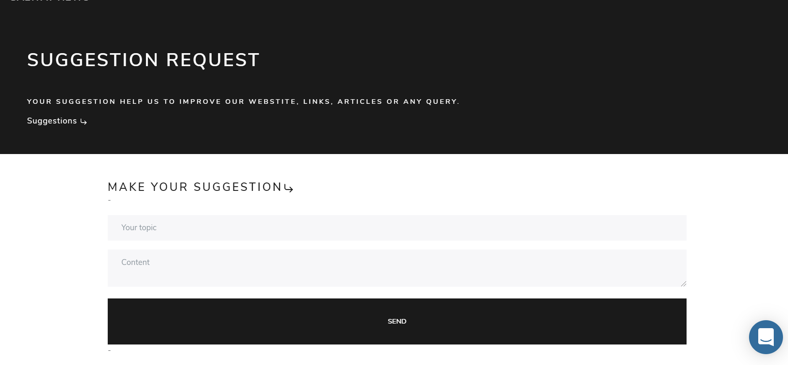
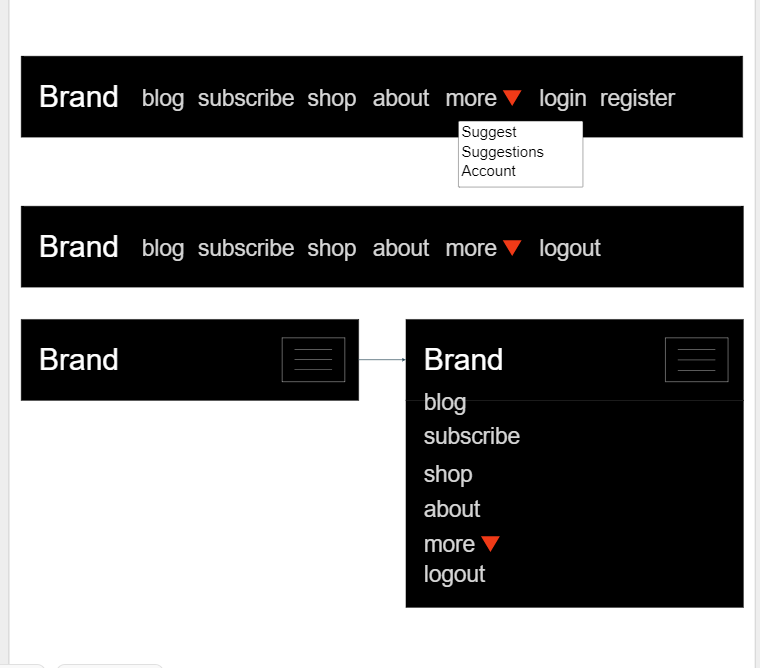

# news galway
Responsive Blog app using django rest framework, Reactjs with ecommerce funcionalities using Stripe.

## Live Demo
The app is deployed running on Heroku: <br/> https://galway-news-app.herokuapp.com/

## About
The app is directed to people from or interested in whats in currently going on in galway city or just interested in follow <br/>
The staff in what they post. <br/>
The Blog features the last news from Galway city divided in four categories "News" "Gastronomy" "Events" <br/>
and "jobs" it has a Donation subscription page and a eccomerce page with a few products that you can buy from. <br/>
You can also meet our staff, view profile and get in touch sending a e-mail with make sugestions or queries. <br/>
The app is also provided of a realtime chat that you can get in touch easily with the staff and a comment section <br />
where authenticated users can interact with posters and view what other users think.
to read more about the articles, filter, view profile, access shop or subscribe you'll be requested to authenticate. <br/>

## Technologies
- <a href='https://www.django-rest-framework.org/' target='_blank'>django-rest-framework</a><br/>
- <a href='https://djoser.readthedocs.io/en/latest/getting_started.html' target='_blank'>Djoser</a><br/>
- <a href='https://jwt.io/introduction/' target='_blank'>JWT Authentication</a><br/>
- <a href='https://www.heroku.com/postgres' target='_blank'>Heroku PostgresSQL</a><br/>
- <a href='https://docs.djangoproject.com/en/3.1/ref/contrib/admin/' target='_blank'>Django admin panel</a><br/>
- <a href='https://github.com/summernote/django-summernote' target='_blank'>Django Summernote</a><br/>
- <a href='https://reactjs.org/' target='_blank'>ReactJs</a><br/>
- <a href='https://react-redux.js.org/' target='_blank'>React Redux</a><br/>
- <a href='https://reactjs.org/docs/hooks-intro.html' target='_blank'>React Hooks</a><br/>
- <a href='https://reactrouter.com/web/guides/quick-start' target='_blank'>React router dom</a><br/>
- <a href='https://getbootstrap.com/' target='_blank'>Bootstrap</a><br/>
- <a href='https://stripe.com/docs/stripe-js/react' target='_blank'>React Stripe</a><br/>
- <a href='https://github.com/dennismorello/react-awesome-reveal' target='_blank'>react-awesome-reveal</a><br/>
- <a href='https://www.intercom.com/dr/sponsor-biz?utm_source=google&utm_medium=sem&utm_campaign=8375307833&utm_term=intercom&utm_ad_collection=88632091427&_bt=434730769386&_bg=88632091427&utm_ad=434730769386&offer=sponsoredbybiz&utm_campaign_name=go_evg_acq_trial_b-a_icm_bld_core_en&utm_ad_collection_name=gen-p_intercom&utm_ad_name=sponsoredbybiz_text_21q2' target='_blank'>Intercom real-time chat bot</a><br/>

## User Experience (UX)

-   ### User stories

    -   #### Staff User

        1. As a Staff user, I want to have a nice experience and easily write and edit my blog posts.
        2. As a Staff user, I want to be able to easily manage the products and the website content.
        3. As a Staff user, I want to know what non staff users think about my job with comments.
        3. As a Staff user, I want non staff users have the option to know more about me and get in touch.

    -   #### Non Staff User

        1. As a non staff user, I want to Know where I need to go when I first get into the website.
        2. As a non staff user, I want to find the best way to get in touch, with the staff.
        3. As a non staff user, I want to view the relevant news with a nice and beaultiful UI.
        3. As a non staff user, I want to feel integrated to the app with comments and suggestions.


-   ### Design
    -   #### Colour Scheme
        -   Galway news use 2 main colors: Black and white.
    -   #### Typography
        -   Roboto it's the main font imported from google fonts.


## Features, Fuctionalities and Returmimg User Experience

### Backend 

- App built in Django Rest Framework divided in 8 apps: accounts, authors, blogs, products, subscriptions cantacts and suggestioins.
- accounts: 
    Stores all users in the application, the custom user model. using Djoser as library <br/>
    the app uses Djoser's default permissions. Any CRUD operation in the user it's allowed the  <br />
    Current user or Admin, in this case if user try to list or any action to users it's gonna have <br />
    effect to his own user only. you can also: create account 'allow any', activate account email: 'allow any',  <br />
    create session or token: 'allow any', destroy token: 'Autenticated', reset and comfirm reset password email: 'allow any', <br/>
    reset and comfirm reset user name email: 'allow any'. Admin users can perform any crud action in the Admin panel to users <br />
    In the Admin panel admin users can create, update and delete accounts.
- authors: Stores our staff profile as a separated entity from accounts that represents our staff. Any user can list all authors. <br/> 
    However you want to get an specific author by id you need to be Authenticated. the app has a one to many to blogs app where <br/>
    resides all post in the app, The author can have many posts. <br/>
    In the Admin panel admin users can create, update and delete accounts.
- blogs: Stores all posts in application. Any user can list all posts but in order to view a single post by slug, users need  <br/>
    to be authenticated the app is related to authors app. a post can have an Author, only admin users can poerform delete requests. <br/>
    the app also handler send email fuctionalities when users create when request new passords. <br/>
    post are created in the Admin panel by admin users only, other than update and delete.
- comments: Stores all comments in the application, if authenticated users can create and list comments but in order to update or <br/>
    delete the user has to be the comment owner by custom permission, the app is related to blogs app, a blog post can have,
    many comments. <br/>
    In the Admin panel admin users can create, update and delete comments.
- products: Stores all Stripe products in the databese 'including id keys': Authenticated users can only read products and buy products  <br />
    the rest in handled by stripe, you can view all logs in the app through stripe dashboard create new products,  <br />
    custom email template, discount cupons and way more features improving security.  <br />
    The products can be managed through the admin panel by admin users, create, delete amnd update.
- subscriptions: Stores all Stripe subscription products in the databese 'including id keys': Authenticated users can only read products   <br />
    and buy products the rest in handled by stripe, you can view all logs in the app through stripe dashboard create new products,  <br />
    custom email template, discount cupons and way more features improving security.  <br />
    The subscriptions products can be managed through the admin panel by admin users, create, delete amnd update.
- contacts: Handle send email funcionalitie and Stores in the database. Any user can perform a post request to get in touch. <br/>
    those sent emails can be manage by admin users in the admin panel.
- suggestions: Stores suggestions made by users, any authenticated user can send a request or list them however only the suggestion owner <br/>
    can update or delete by custom permission. <br/> 
    also suggestions can be manage by admin users in the admin panel.
    
#### Extra:

- Django administration panel:
    Django admin panel plays a important role in this application, as staff users are going to make posts and manage the other resoures <br/>
    through it. because of that the admin interface has been customised in other to match the website's theme colors, and improve <br/>
    users experience.
    <details>
    <summary>Click to views admin login</summary>
    

    </details>
    <details>
    <summary>Click to views admin dashboard</summary>
    

    </details>
    <details>
    <summary>Click to views admin logout</summary>
    

    </details>
- <a href='https://github.com/summernote/django-summernote' target='_blank'>Django Summernote:</a><br/>
    As the application is essentially blog, and staff users can writte the posts through the admin panel django summernote is markdown <br />
    editor that makes so easy to implement images, videos, links, colors etc... it makes a huge diferrence for staff users writing they <br/>
    posts. However precations have to be taken while writing or editing the posts. as in the frontend is set innerHTML to render the <br/>
    a bad adition can break the layout, but it can be fixed editing again the post.
    </details>
    <details>
    <summary>Click to views Django Summernote editor</summary>
        

    </details>

 - SMTP configuration: 
    I'm using a smtp service ofered by gmail to handle send emails, to create account, request new password, oer contact us <br/>
    create your credentials to fill your .env file following those steps on 
    <a href='https://support.google.com/mail/answer/185833?hl=en-GB'>GOOGLE</a>  or use Mailtrap or whatever service you prefer.

### Frontend
- Create react app  using react-router-dom to manage all routes in the app. <br/>
- Home Page: <br />
    Landing page that gives you a few options of navigation 'Start' 'Shop' 'Subscribe' 'register' 'login,  github's and likendin's links <br />
    <details>
    <summary>Click to views Home Page</summary>
    

    </details>
- Blog Page: <br />
    List all posts and the featured post in the application, users can click in each post to read more about the post howerver users <br />
    need to be authenticated in order to see the post details.
    <details>
    <summary>Click to views Blog Page</summary>
    

    </details>
    Clicking in any post the user will be direct to a page with all about the post, content, author and when it was posted.
    <details>
    <summary>Click to views Blog Single Page</summary>
    

    </details>

- Comments: <br />
    When clicking in one blog users are direct to a read more page. in the botton of the page there's a comments section <br/>
    where users can iteract with the post comments, theyu can alsdo update and delete they own comments.
    <details>
    <summary>Click to views Comments Section </summary>
    

    </details>

- Shop and Subscribe Page: <br />
    Shop page lists all products avalibe in the website. as e-commerce is not the websites focus galway news ha just a few products <br/>
    that users can purchase, The subscription page is very similar but with montly plans instead, users can subscribe in order to support <br/>
    the website donating. After users transactions users can have a visual feedback if payment has been made 'Success' or not 'Fail'.
    <details>
    <summary>Click to views Shop Page</summary>
    

    </details>
    
    <details>
    <summary>Click to views Subscribe Page</summary>
    

    </details>

    <details>
    <summary>Click to views Success Page</summary>
    

    </details>

    <details>
    <summary>Click to views Failed Page</summary>
    

    </details>

- About Page: <br />
    About page is devided in 3 subsections, About us: users can have the opportunity to know more about the company  <br/>
    Get in touch: users can easily get in touch with Galway news sending a Email. <br />
    Authors: Users can have the opportunity to know more about the staff, users can click to know more info <br />
    about the but to do that they need to be authenticated.
    <details>
    <summary>Click to views about us and get in touch sectiion</summary>
    

    </details>

    <details>
    <summary>Click to views authors sectiion</summary>
    

    </details>

- Account Page: <br />
    Page where users can view their own account information or logout, the page allows users to reset their usernames <br/>
    or password.
    <details>
    <summary>Click to views Account Page</summary>
    

    </details>

- Suggestions and Suggest Pages: <br />
    In Suggest page is the space where users can send suggestions or queries, Sugestions Page is the space where  <br/>
    all suggestions are listed. users can also update and delete their own suggestions or know more about it by clicking.
    <details>
    <summary>Click to views Suggest Page</summary>
    

    </details>

    <details>
    <summary>Click to views Suggestions Page</summary>
    

    </details>


### Database Model.

<details>
<summary>Click to views Structure</summary>


</details>


### Mockups

  - Header <br/> 
  
    <details>
    <summary>Click to views Mockups</summary>
       

    </details>    

  - Authentication <br/> 
  
    <details>
    <summary>Click to views Mockups</summary>
       

    </details>        

  - Blog <br/> 

    <details>
    <summary>Click to views Blog Mockups</summary>
    

    </details>
    
    <details>
    <summary>Click to views Comment Mockups</summary>
    

    </details>        

  - Shop & Subscribe <br/> 
 
    <details>
    <summary>Click to views Comment Mockups</summary>
    

    </details>        

  - About <br/> 

    <details>
    <summary>Click to views About Mockups</summary>
    

    </details>            

  - Suggestions & Suggest <br/> 

    <details>
    <summary>Click to views Suggestions and Suggest Mockups</summary>
    

    </details>            


### Testing

#### Rendering and Endpoints

- Blog posts
    
    <details>
    <summary>Endpoints</summary>
    
     <details>
     <summary>List blog posts: http://127.0.0.1:8000/api/blog/  [GET]</summary>    
        Endpoint returns all blog posts in the api: status 200 <br/>
        If there is no posts returns an [ ] status 200 <br/>
        The route is public anyone can access. <br/><br/>
    
     

     </details>     
     
     <details>
     <summary>Featured blog posts: http://127.0.0.1:8000/api/blog/featured  [GET]</summary>    
        Endpoint returns the featured blog posts in the api: status 200  <br/>
        If there is no posts returns an [ ] status 200 <br/>
        The route is public anyone can access. <br/><br/>
    
     

     </details>    
     
     <details>
     <summary>Find blog posts by slug: http://127.0.0.1:8000/api/blog/ {slug}  [GET]</summary>    
        Endpoint find the blog posts passing the slug as the last param: status 200 <br/>
        If the post doesn't exists returns "Not found" <br/>
        The route is not public try to access without authorization returns <br/>
        "Authentication credentials were not provided.": status 401.
    
     </details>            

     <details>
     <summary>Find blog posts by specific category: http://127.0.0.1:8000/api/blog/category  [POST]</summary>    
        Endpoint returns all blog posts of spacific category <br/>
        example: 'jobs' or 'events': status 200  <br/>
        If there is no posts returns an [ ] status 200 <br/>
        The route is public anyone can access. <br/><br/>
    
     

     </details>    

     <details>
     <summary>delete blog posts by ID: http://127.0.0.1:8000/api/blog/ {pk}  [DELETE]</summary>    
        Endpoint deletes blog post passing id as a param and returns status 204 <br/>
        Only admin users can access the route returns try to access route without <br/>
        admin powers returns" Authentication credentials were not provided.": status 401.

     </details>    
    </details>            

    <details>
    <summary>Rendering</summary>

     <details>
     <summary>Rendering posts</summary>
        Post can be only added using admin panel. <br/>
        but staff users can either delete or update posts. <br/> 
        Once added posts are rendered in the frontend. <br/><br/>
     

     </details>            

    </details>            

- Comments

    <details>
    <summary>Endpoints</summary>
    
     <details>
     <summary>List comments: http://127.0.0.1:8000/api/comments/  [GET]</summary>    
        Endpoint returns all comments in the api: status 200 <br/>
        If there is no posts returns an [ ] status 200 <br/>
        The route is not public try to access without authorization returns <br/>
        "Authentication credentials were not provided.": status 401. <br/> <br/>
    
     

     </details>     
     
     <details>
     <summary>Find comment by Id: http://127.0.0.1:8000/api/comments/ {pk}  [GET]</summary>    
        Endpoint find the comment passing the id as the last param: status 200 <br/>
        If the post doesn't exists returns "Not found" status 404 <br/>
        The route is not public try to access without authorization returns <br/>
        "Authentication credentials were not provided.": status 401. <br/> <br/>

     

     </details>            

     <details>
     <summary>Post comment: http://127.0.0.1:8000/api/comments/create  [POST]</summary>    
        Endpoint creates blog post and returns itself <br/> 
        By default users must be logged in order to post comment<br/>
        The route is not public try to access without authorization returns <br/>
        "Authentication credentials were not provided.": status 401. <br/> <br/>
    
     </details>    

     <details>
     <summary>delete blog posts by ID: http://127.0.0.1:8000/api/comments/delete {pk}  [DELETE]</summary>    
        Endpoint deletes comment post passing id as a param and returns status 204 <br/>
        If non author user try to delete comment returns: 'Editing Comments is restricted to the creator only'<br/>
        The route is not public try to access without authorization returns <br/>
        "Authentication credentials were not provided.": status 401. <br/> <br/>

     </details>
     
     <details>
     <summary>delete blog posts by ID: http://127.0.0.1:8000/api/comments/update {pk}  [PUT]</summary>    
        Endpoint updates comment post passing id as a param and returns status 204 <br/>
        If non author user try to delete comment returns: 'Editing Comments is restricted to the creator only'<br/>
        The route is not public try to access without authorization returns <br/>
        "Authentication credentials were not provided.": status 401. <br/> <br/>

     </details>    

    </details>            

    <details>
    <summary>Rendering</summary>

     <details>
     <summary>Rendering comments</summary>
        To comment users have to be logged in. <br/>
        buttons update and delete appear to comment owner only. <br/> 
        Once added posts are rendered in the frontend. <br/><br/>
     

     </details>            

    </details>            

- Suggestions

    <details>
    <summary>Endpoints</summary>
    
     <details>
     <summary>List suggestions: http://127.0.0.1:8000/api/suggestions/  [GET]</summary>    
        Endpoint returns all suggestions in the api: status 200 <br/>
        If there is no suggestions returns an [ ] status 200 <br/>
        The route is not public try to access without authorization returns <br/>
        "Authentication credentials were not provided.": status 401. <br/> <br/>
    
     

     </details>     
     
     <details>
     <summary>Find suggestions by id: http://127.0.0.1:8000/api/suggestions/ {pk}  [GET]</summary>    
        Endpoint find the suggestion passing the id as the last param: status 200 <br/>
        If the suggestions doesn't exists returns "Not found" status 404 <br/>
        The route is not public try to access without authorization returns <br/>
        "Authentication credentials were not provided.": status 401. <br/> 

     </details>            

     <details>
     <summary>Post suggestion: http://127.0.0.1:8000/api/suggestions/create  [POST]</summary>    
        Endpoint creates suggestion and returns itself <br/> 
        By default users must be logged in order to post suggestions<br/>
        The route is not public try to access without authorization returns <br/>
        "Authentication credentials were not provided.": status 401. <br/> <br/>
    
     </details>    

     <details>
     <summary>delete blog posts by ID: http://127.0.0.1:8000/api/comments/delete {pk}  [DELETE]</summary>    
        Endpoint deletes suggestion passing id as a param and returns status 204 <br/>
        If non author user try to delete suggestion returns: 'Editing suggestions is restricted to the creator only'<br/>
        The route is not public try to access without authorization returns <br/>
        "Authentication credentials were not provided.": status 401. <br/> <br/>

     </details>
     
     <details>
     <summary>delete blog posts by ID: http://127.0.0.1:8000/api/comments/update {pk}  [PUT]</summary>    
        Endpoint updates suggestion post passing id as a param and returns status 204 <br/>
        If non author user try to delete suggestion returns: 'Editing suggestions is restricted to the creator only'<br/>
        The route is not public try to access without authorization returns <br/>
        "Authentication credentials were not provided.": status 401. <br/> <br/>

     </details>    

    </details>            

    <details>
    <summary>Rendering</summary>

     <details>
     <summary>Rendering suggestions</summary>
        To comment users have to be logged in. <br/>
        buttons update and delete appear to suggestion owner only. <br/> 
        Once added posts are rendered in the frontend. <br/><br/>
     

     </details>            
    </details>            

- Authors
    
    <details>
    <summary>Endpoints</summary>
    
     <details>
     <summary>List authors: http://127.0.0.1:8000/api/authors/  [GET]</summary>    
        Endpoint returns all blog posts in the api: status 200 <br/>
        If there is no posts returns an [ ] status 200 <br/>
        The route is public anyone can access. <br/><br/>
    
     </details>   
     
     <details>
     <summary>Find blog posts by id: http://127.0.0.1:8000/api/authors/ {pk}  [GET]</summary>    
        Endpoint find the author passing the id as the last param: status 200 <br/>
        If the post doesn't exists returns "Not found" <br/>
        The route is not public try to access without authorization returns <br/>
        "Authentication credentials were not provided.": status 401.
    
     </details>              
    </details>            

    <details>
    <summary>Rendering</summary>

     <details>
     <summary>Rendering Authors</summary>
        Authors can be only added using admin panel. <br/>
        staff users can also delete or update posts. <br/> 
        Once added posts are rendered in the frontend. <br/><br/>
     

     </details>            
    </details>
    
- Contacts

    <details>
    <summary>Endpoint</summary>
     <details>
     <summary>Post Email: http://127.0.0.1:8000/api/suggestions/  [POST]</summary>    
        It has one post endpoint only returns: Email sent successfully <br/>
        or Email failed to send if failed. <br/>
        The route is public anyone can access. <br/><br/>

     
    
     </details>     
    </details>            

    <details>
    <summary>Rendering</summary>

     <details>
     <summary>Rendering Email</summary>
        To comment users have to be logged in. <br/>
        buttons update and delete appear to suggestion owner only. <br/> 
        Once added posts are rendered in the frontend. <br/><br/>
     

     </details>            
    </details>

- Subscribe and Products
    
    <details>
    <summary>Endpoints</summary>
    
     <details>
     <summary>List Products or Subscriptions: http://127.0.0.1:8000/api/{products || subscriptions}/  [GET]</summary>    
        Endpoint returns all products or subscriptions in the api: status 200 <br/>
        If there is no products or subscriptions returns an [ ] status 200 <br/>
        The route is not public try to access without authorization returns <br/>
        "Authentication credentials were not provided.": status 401.
    
     </details>     
    </details>            

    <details>
    <summary>Rendering</summary>

     <details>
     <summary>Rendering and transaction</summary>
        To add product you must get product_id on stripe dashboard <br/>
        products or subscriptions can be only added using admin panel. <br/>
        staff users can also delete or update posts. <br/> 
        Once added posts are rendered in the frontend. <br/>
        Use `4242424242424242`	to Succeeds and immediately processes the payment. <br/>
        Use `4000000000003220`	to 3D Secure 2 authentication must be completed for a successful payment. <br/>
        Use `4000000000009995`	To fails with a decline code of insufficient_funds.<br/><br/>
            

     </details>            
    </details>
    
- Create account and Authentication
    
    <details>
    <summary>Endpoints</summary>
    
     <details>
     <summary>Create account: http://127.0.0.1:8000/auth/users/  [POST]</summary>    
        Sending post request to this endpoint with 'name', 'email', 'password'  <br/>
        and 're_password' returns itself if succefully created: status 200 <br/>
        However the account remains inactive users need to activate in the email used to create the account <br/>
        If the email used to create the account already exists returns <br/>
        "user account with this email already exists" status 400. <br/>
        The route is public anyone can access. <br/><br/>
    
     </details>
     
     <details>
     <summary>Activate account: http://127.0.0.1:8000/auth/users/activation/  [POST]</summary>    
        To activate account the endpoint requires 2 params 'uid' and 'token'  <br/>
        those params are sent to the email used to create the account <br/>
        By sending those params recieved actives the account returning  a status 204 <br/>
        If the token is invalid it returns "Invalid token for given user." status 400 <br/>
        If the token has been already used returns "Stale token for given user". status 403 <br/>
        The route is public anyone can access. <br/><br/>
         

    
     </details>     
     <details>
     <summary>Create Session: http://127.0.0.1:8000/auth/jwt/create  [POST]</summary>    
        To Login account the endpoint requires 2 params 'email' and 'password'  <br/>
        If the params if correct returns status 200 and access token and refresh <br/>
        If one of the params are incorrect returns status 401 and <br/>
        "No active account found with the given credentials" <br/>
        The route is public anyone can access. <br/><br/>
         

    
     </details>     
     <details>
     <summary>Request new password: http://127.0.0.1:8000/auth/users/reset_password/  [POST]</summary>    
        To Request password the endpoint requires a params the current 'email'   <br/>
        it returns a status 204 and send and email to reset account <br/>
        The route is public anyone can access. <br/><br/>

     </details>     
     <details>
     <summary>Set new password: http://127.0.0.1:8000/auth/users/reset_password_confirm/  [POST]</summary>    
        To Request password the endpoint requires 4 params 'new_password', 're_new_password   <br/>
        'uid' and 'token' that the user recieve after Request new password <br/>
        By sending those params recieved actives the account returning  a status 204 <br/>
        If the token is invalid it returns "Invalid token for given user." status 400 <br/>
        If the token has been already used returns "Stale token for given user". status 403 <br/>
        The route is public anyone can access. <br/><br/>

     </details>     

    </details>            

    <details>
    <summary>Rendering</summary>

     <details>
     <summary>Rendering Create account</summary>
        Complete Register form 'Name", 'email', "Password", "Comfirm Password" <br/>
        Password field is validated, it requires a good level of complexity. <br/>
        After send form user is required to comfirm in the email account. <br/> 
        Users, can be created, updated and deleted by the staff in the admin panel. <br/><br/>
        Creating account <br/>
        <br/><br/>
        Email received<br/>
        

     </details>
     <details>
     <summary>Rendering Authentication</summary>
        Authentication form requires 'Name" and 'email' <br/>
        If something goes wrong it returns "Authentication Failed". <br/>
        If Login is successfull the user is redireted to Blog post <br/>
        Login <br/>
        <br/><br/>

     </details>            

    </details>

- Users
    
    <details>
    <summary>Endpoints</summary>
    
     <details>
     <summary>List, Update or Delete User: http://127.0.0.1:8000/auth/users/me  [GET], [DELETE], [PUT]</summary>    
        By default Users can List, Delete or Update himself only using this route, <br/>
        Try to access the route without authorization returns <br/>
        "Authentication credentials were not provided.": status 401.
    
     </details>     
    </details>            

    <details>
    <summary>Rendering</summary>

     <details>
     <summary>Rendering User</summary>
        User rendered in the frontend. <br/>
        Renderting User <br/><br/>
        

     </details>            
    </details>
    
#### Navigation

   Links Header: working fine Usage <Link /> from 'react-router-dom' to define links inside the application. <br/>
   fluid navigation between pages. <br/>
   
   Links Home Page: All links working fine fluid navigation used <a/> blank for external links. <br/>
   
   Links Pages and Redirects: All Links diretect to assigned location, Authenticated redirect to <br/>
   Blogs and "need to login" Redirect working well, No links Broken.
   
   
#### Forms
    
   Login and Register form: Both forms required by HTML validation and types specified <br/>
   Register field requires complex pattern, minLength and javascript validation to increase security. <br/>
   
   Post Suggestion and Get in touch form: Both forms Have all fields required and <br/>
   minLength to prevent send blank.
   
   
#### Buttons

   Event Buttons: Working as expected Login, Register, Suggest, Get in touch, Comment: Posting well. <br/>
   Account, Comment, Suggestion: Updating well. Comment, Suggestion and Blog Post deleting well. <br/>
   
   Comment and Suggestion buttons: Update and deletew buttons are hidden if user is not comment or suggestion <br/>
   owner.
   
   Shop and Subscribe buttons: Redirecting to stripe checkout ok!
   
   
#### Compatibility and Responsive design

   The app has been tested in those browsers:
   
   Chrome <br/>
   Brave <br/>
   Edge <br/>
   Firefox
   
   Mobile:
   
   Iphone 10 <br/>
   Sansung Galaxy S7 <br/>
   Sansung A10
   
   and Browser inspector 
   
   All Sizes.
   
#### Javascript and HTML testing

   ESlint: Tool that verifies and correct automatcally javascript and HTML <br/>
   errors, prevents and reports syntax errors.
   
   
#### Extra info testing

   The app has been tested also by: <br/>
   other Professional developers <br/>
   my mentor Aaron. <br/>
   family and friends <br/>
   Tested and documented by me.
   
   
### Known Bugs

   Because of Blog posts are set as innerHTML in the frontend <br/>
   if the edition in the Editor is big than the hyperview can breaks <br/>
   the layout.
   

### Usage

   #### Run api
   
Requirements: <br/>
<a href='https://www.python.org/'>Python</a> and <a href='https://pypi.org/project/pip/'>Pip</a>
   - In your root diredtory: <br/>     
   In your `.env.example` rename the file to > `.env` and change the Env variables.
   - Windows: <p>
    
    ```
        cd server
        python -m venv env
        env/Scripts/activate
        pip install -r requirements.txt
        python manage.py runserver
    ```   
 </p>
   - Linux or mac: <p>
    
    ```
        cd server
        python -m venv env
        source env/bin/activate
        pip install -r requirements.txt
        python manage.py runserver
    ```   
 </p>
 <br/>
    Your api is running in your localhost on port: 8000 Now you're ready to go! 🚀

   #### Run client:

Requirements: <br/>
<a href='https://nodejs.org/en/'>Nodejs and NPM</a> <br/>
opcional
<a href='https://yarnpkg.com/'> Yarn</a> <br/>

In the root folder. <br/>
`cd client` folder. <br/>
Rename `.env.example` to `.env` and change the env variables. <br/>

in the terminal run `yarn` or `npm run`<br/>
Than `yarn start` or `npm run start` <br/>

*Remenber: You will need to have your api running too!. <br/>
*Now you're ready to go!. 🚀🚀


## Deployment 

The app is deployed on Heroku. <br/>
Requirements: <br/>
<a href='https://github.com/heroku/django-heroku'>Heroku_django</a>
<a href='http://whitenoise.evans.io/en/stable/'>WhiteNoise</a> for static files. <br/>
`warning` if you're usig the current version of django-simplejwt=6.0.0 for some reason <br/>
is not compatible with heroku use version: 4.4.0

cd your `client` folder and run `yarn build` it will generate a build of your react app copy <br/>
the `build` folder in your `server` folder.

Download and install the Heroku CLI.

Than cd `server` and Configure your App and postgres DB on Heroku.

Log in to your Heroku account. <br/>
```
$ heroku login 
```
Clone the repository <br/>
Use Git to clone your app code source code to your local machine. <br/>
```
$ heroku git:clone -a galway-news 
$ cd galway-news 
```
Deploy your changes <br/>
Make some changes to the code you just cloned and deploy them to Heroku using Git. <br/>
```
$ git add . 
$ git commit -am "make it better" 
$ git push heroku master 
```
Don't forget to set your env variables!

Done! you made it! 🚀🚀🚀

#### Extra: Apply custom css to admin panel  `not required`
    
   In the `client` folder
   
   go to `src/django_admin` folder: <br/><br/>
   <details>
     <summary>View folder</summary>    
     

   </details>
   
   Than paste into the `build` folder like this:
   
   <details>
     <summary>View folder</summary>    
     

   </details>
   
   The files it's simply an html file that extends Django's admin template <br/>
   with an css file that overrides the currenmt styles.


## Acknowledgements

- I received inspiration for this project from:
  
  https://codeinstitute.net/
    
  My mentor for his Aaron Help 
   
## License

- Free Open Source.
  


